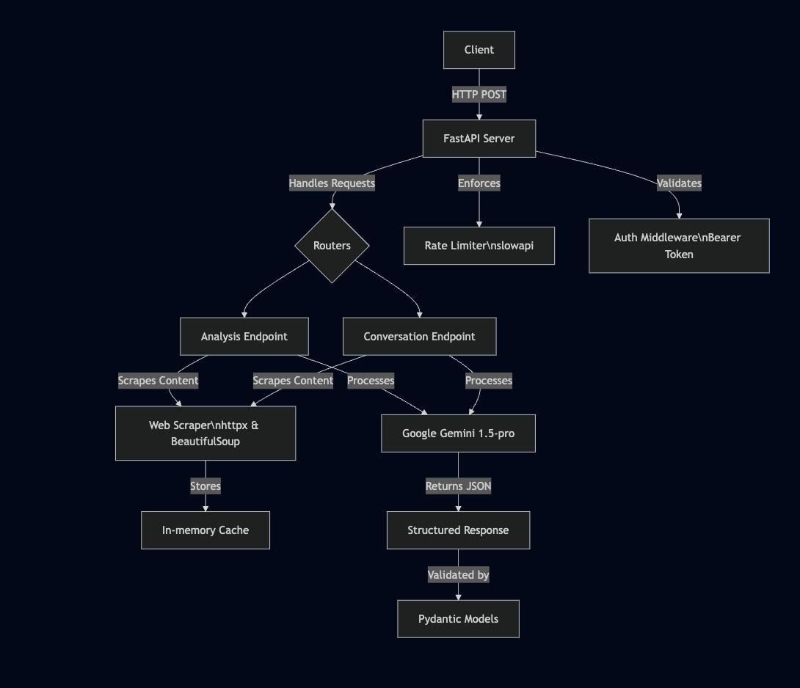

# Advanced FastAPI AI Agent for Website Intelligence

A FastAPI application that scrapes and analyzes website homepages using AI to extract business insights and support conversational queries.

---

## Architecture Diagram


---

## Technology Justification

- **FastAPI:** Asynchronous, high-performance, with Pydantic for robust request/response validation.
- **httpx & BeautifulSoup:** Reliable for async HTTP requests and HTML parsing with redirect handling.
- **Google Gemini 1.5-flash:** Supports structured JSON output and conversational context, ideal for complex content analysis.
- **slowapi:** Simple rate-limiting for API abuse prevention.
- **In-memory Cache:** Reduces redundant scraping for efficiency.

---

## AI Model Used & Rationale

- **Model:** Google gemini-1.5-flash
- **Rationale:** Provides structured JSON responses via schema enforcement, excels in semantic extraction and conversational tasks, and supports high token limits for detailed website analysis.

---

## Deployment

- **Backend URL:** `https://website-intelligence.onrender.com`


### ENV Keys

- `SECRET_KEY`: For API authentication
- `GEMINI_API_KEY`: For Google Gemini API access

---

## UI

- **Frontend URL:** `https://website-intelligence.vercel.app/`

---

## Local Setup & Running Instructions

1. **Clone the repository:**
    ```bash
    git clone https://github.com/Kajal-Gupta23/Firmable-Website-Intelligence.git
    cd backend
    ```

2. **Install dependencies:**
    ```bash
    pip install -r requirements.txt
    ```

3. **Create a `.env` file:**
    ```
    SECRET_KEY=your_secret_key
    GEMINI_API_KEY=your_gemini_api_key
    ```

4. **Run the FastAPI server:**
    ```bash
    python3 main.py
    ```

5. **Access at:** [http://localhost:8000](http://localhost:8000)

---

## API Usage Examples

### Endpoint 1: Analyze Website

```bash
curl -X POST http://localhost:8000/analyze-website \
     -H "Content-Type: application/json" \
     -H "Authorization: Bearer your_secret_key" \
     -d '{
           "url": "https://www.example.com",
           "questions": ["What is their primary business model?"]
         }'
```

**Response:**
```json
{
  "url": "https://www.example.com",
  "analysis_timestamp": "2025-07-16T03:11:00Z",
  "company_info": {
    "industry": "Digital Engineering",
    "company_size": "Large (10,000+ employees)",
    "location": "Pune, India",
    "core_products_services": ["Cloud Services", "AI Solutions"],
    "unique_selling_proposition": "End-to-end digital transformation",
    "target_audience": "Enterprises",
    "contact_info": {
      "email": "info@example.com",
      "phone": null,
      "social_media": {
        "linkedin": "https://linkedin.com/company/example-systems",
        "twitter": null
      }
    }
  },
  "extracted_answers": [
    {
      "question": "What is their primary business model?",
      "answer": "Service-based digital engineering"
    }
  ]
}
```

---

### Endpoint 2: Conversations API

```bash
curl -X POST http://localhost:8000/conversations \
     -H "Content-Type: application/json" \
     -H "Authorization: Bearer your_secret_key" \
     -d '{
           "url": "https://www.example.com",
           "query": "What are their AI services?",
           "conversation_history": [
             {"user": "What is the company about?", "agent": "Systems provides digital engineering and enterprise modernization."}
           ]
         }'
```

**Response:**
```json
{
  "url": "https://www.example.com",
  "user_query": "What are their AI services?",
  "agent_response": "Example offers AI-driven solutions like predictive analytics and intelligent automation.",
  "context_sources": ["AI solutions section", "Technology services page"],
  "updated_conversation_history": [
    {"user": "What is the company about?", "agent": "Example Systems provides digital engineering and enterprise modernization."},
    {"user": "What are their AI services?", "agent": "Example offers AI-driven solutions like predictive analytics and intelligent automation."}
  ]
}
```

---

## IDE Used

- **VS Code:** 